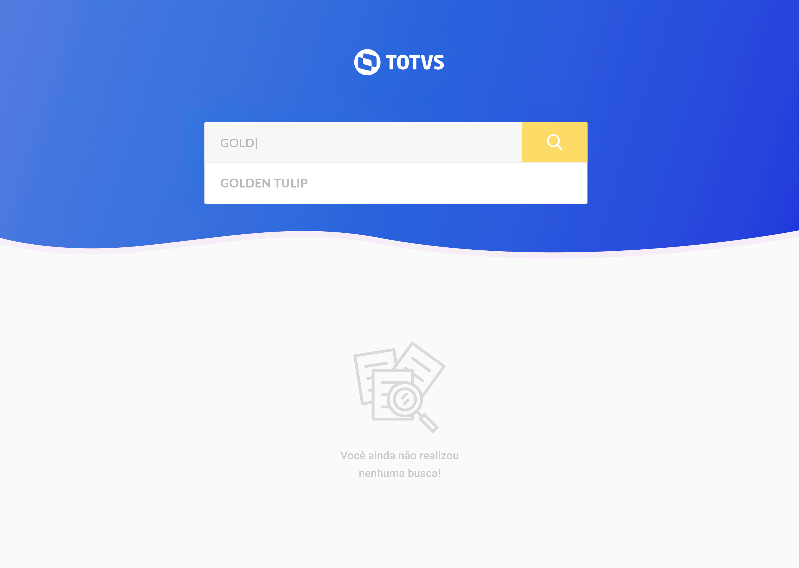
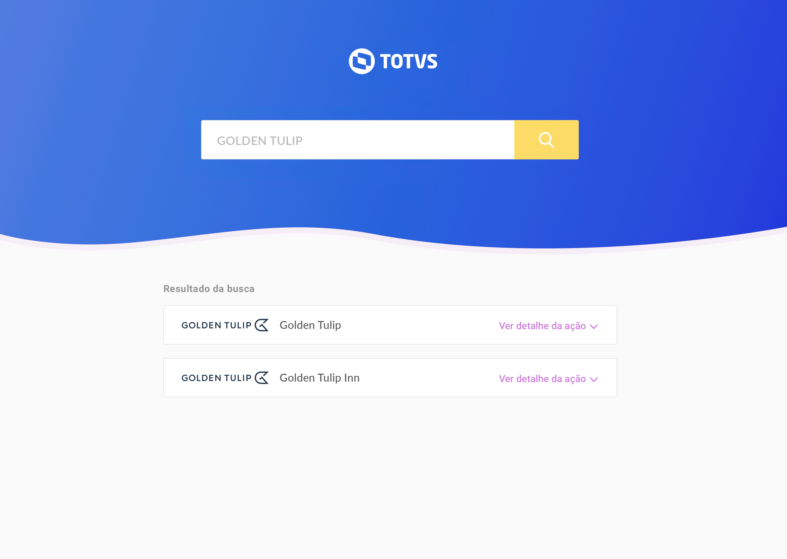
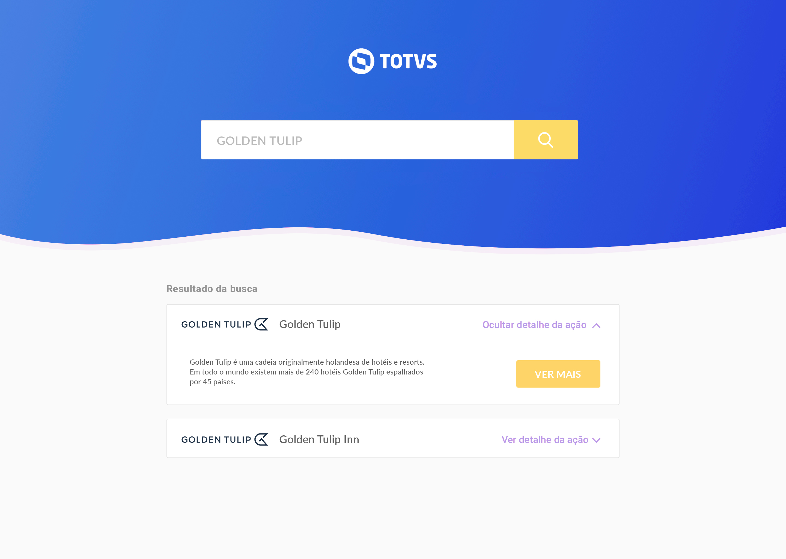
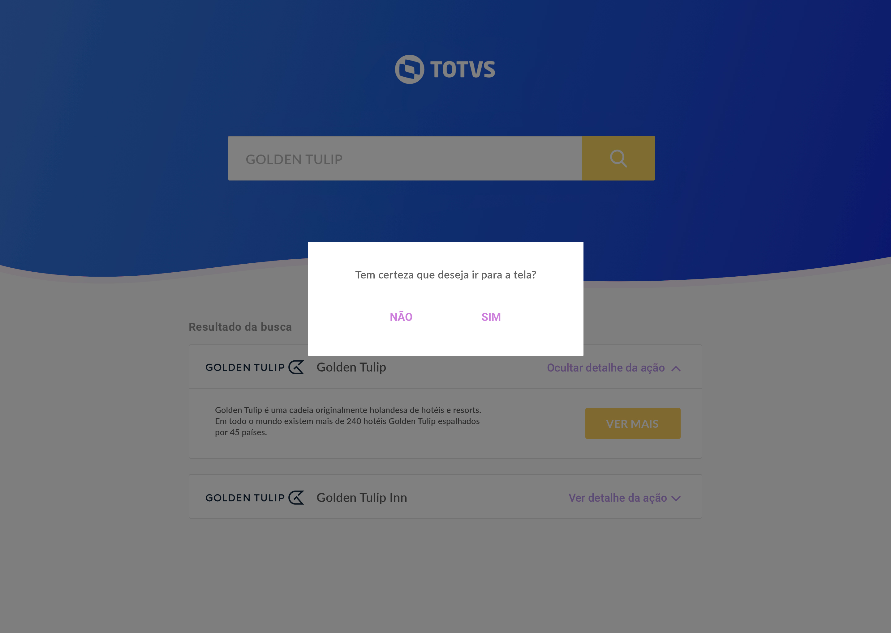

This one is  a search component (with a type ahead feature). Another one I've made as a challenge for some position, it's kinda pixel perfect. I also made the api for this one but the repo is not clean enough to be made public.

#### check the online demo <a href="https://list-hotels.herokuapp.com" target="_blank">here</a>


### Imagens






----------------------

# Desafio TOTVS - Angular List Hotels

<br />
<p align="center">
<p align="center">
  <a href="#o-que-é">O que é</a> •
  <a href="#instalação">Instalação</a> •
  <a href="#rodar">Rodar</a> •
  <a href="#testes">Testes</a> •
  <a href="#contact">Contato</a> •
</p>

## O que é

* Desafio realizado conforme protótipo e espeficicações apresentadas.
* Foi utilizado Angular 9 e NGRX.
* Foram incluídas traduções para inglês e espanhol
* Foi feita configuração básica de PWA buscando, além de mobile first,

## Instalação
* Você deve ter, pelo menos, a versão 10.9 do <a href="https://nodejs.org/en/">Nodejs</a>

* Para evitar conflitos, é aconselhável instalar a ferramenta ng-cli.

```npm install -g @angular/cli```

* Clonar o repositório. Entrar na pasta e instalar o pacotes com

```npm i```

## Rodar

Inicie o aplicativo com um dos comandos abaixo:
```npm start``` ou ```ng start```

Após a compilação, o App estará disponível para acesso
pelo navegador em localhost:4200

## Testes
Para executar os testes, utilize o comando 
```ng test```
